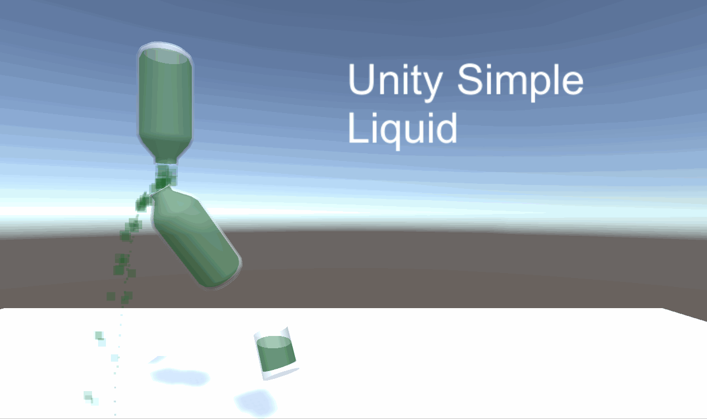

# Unity Simple Liquid
This is simple Liquid Simulation framework for Unity3D.
## Main features
- Calculates liquid surface based on inertia and rotation
- Liquid volume is in liters and changes based on bottle physical size
- Working liquid transfer between liquid containers

## Instalation
Download latest realease [here](https://github.com/Macoron/Unity-Simple-Liquid/releases)

Tested with Unity 2019.2.0f1

## License
This project is licensed under the MIT License
